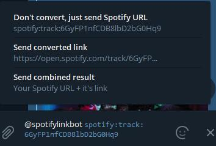

# Spotify URL Converter Telegram Bot

## About

Tired of opening links to a new track or album on Spotify from a friend in the browser? Do your friends often complain to you about the same? Just convert your link in any format using this bot in 3 seconds and open it in any comfy way or send it to your friend!
  
**Original Spotify URL Converter bot: https://t.me/spotifylinkbot**  
  

  
This bot converts links from this format:  
  
`spotify:track:xxxxxxxxxxxxxxxxxx`  
  
To this:  
  
`https://open.spotify.com/track/xxxxxxxxxxxxxxxxx`
  
And vice versa automatically. First link type much comfortable to use on PC app. You just need to put it in search bar in Spotify app. If your friend send you second link type, and it opens in web that you don't need, forward his share message to bot chat and copy `spotify:track:xxxxx...` to search bar.  
  

Links must match that regexes:  
  
`^https://open\.spotify\.com/((album)|(playlist)|(track)|(artist))/\w+(\?\S+)?$`  
`^spotify:((album)|(playlist)|(track)|(artist)):\w+$`  
  
## Inline Mode

You can use this bot without leaving chat which you need to send link. Use Inline Mode! Just type that in your text-line:  
  
`@spotifylinkbot [link]`  
  
  

### Inline Mode Features

Inline mode has the following features:  
  
* Just send your link  
* Send only converted link  
* Send both links, so your chat friend can pick one that he need.  
  
